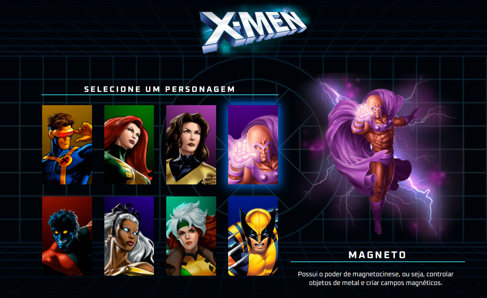
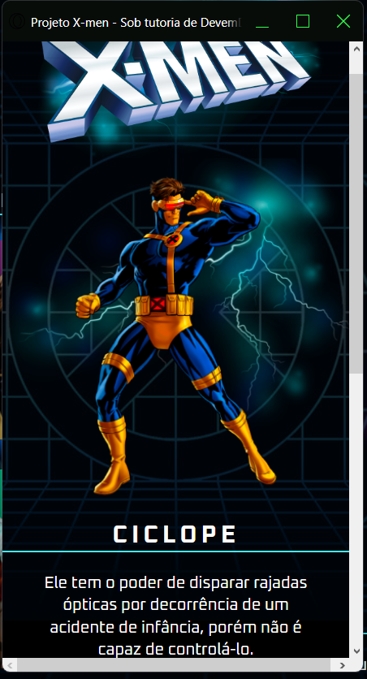
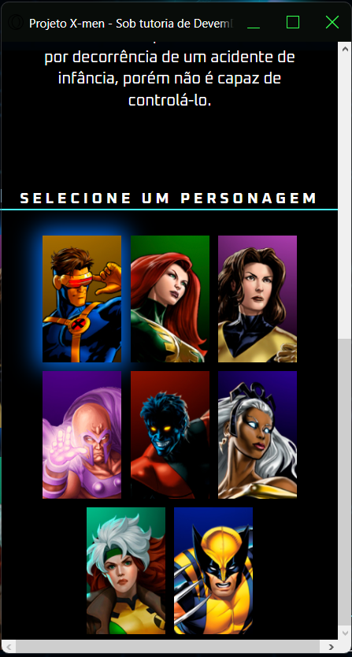

Este projeto foi criado sob tutoria da DevEmDobro, que realizou uma semana de lives para a estruturação do projeto com os interessados.

As especificações da página final foram disponibilizadas no Figma, na URL https://www.figma.com/file/pcXaFvQGmgvIVwTAtfbzCc/Dev-em-Dobro?type=design&node-id=50-1148&mode=design&t=Kf7w6LMOitALiRJ1-0, para desktop e telas menores (celulares).

A base desse projeto foi feita em HTML5, estilizada em CSS3 e dinamizada com JavaScript.

Seguem alguns passos importantes para a realização do projeto:

* A linguagem foi alterada de inglês para português.

* No HEAD do HTML foram adicionados os links para os arquivos CSS e adicionada a fonte específica do projeto.

* Para entender melhor a estruturação no HTML, a página final do projeto foi estudada e então feitas as divisões que mais se adequariam ao proposto.

* Foram feitas três divisões principais: uma para a imagem de cabeçalhom, uma onde ficaria o quadro com todos os personagens e outra com a imagem de corpo inteiro de um personagem específico, seu nome e texto referente.

* Foram definidos IDs diferentes para cada personagem e adicionadas classes de acordo com a necessidade de estilização de cada segmento.

* Foram feitos três arquivos de estilo: 
 - reset.css para zerar as configurações de praxe. 
 - responsive.css para deixar a página responsiva a celulares utilizando das medias queries.
 - style.css para adicionar plano de fundo, cabeçalho, adicionar a fonte, organizar a disposição dos containers e dos itens dentro deles, adicionar a cor de sombra para cada personagem, características das fontes (cor, tamanho, intensidade), distância entre os elementos, divisórias e características de texto.

 * No arquivo JavaScript foram adicionadas as dinamizações do projeto, usando as IDs, data-name e data-description adicionadas no HTML para realizar as mudanças definidas no projeto, tanto para a passagem do mouse, quanto para a troca dos personagens/nome/texto no segundo quadro (à direita).

 * Seguem registros da página:

- Página completa de visualização em DeskTop.

 

- Dinamização no Desktop.

 

- Página para visualização em celular 01.

- Página para visualização em celular 02.

